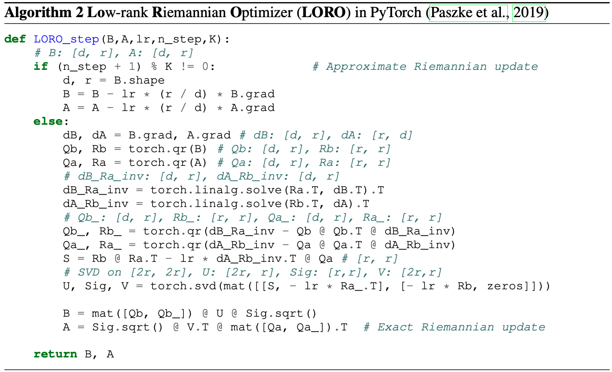

# Official Implementation of Low-rank Riemannian Optimizer (LORO)

## Overview

This repo contains the pre-release implementation of **L**ow-rank **R**iemannian **O**ptimizater (**LORO**), proposed in [LORO: Parameter and Memory Efficient Pretraining via Low-rank Riemannian Optimization, ICLR 2025](https://openreview.net/forum?id=i0zzO7Hslk).

To achieve efficient yet effective pretraining for low-rank language models, this repo implements a Low-rank Riemannian Optimizer (LORO). At each exact LORO update step, the low-rank factor pairs $\mathbf{B}$ and $\mathbf{A}$ are jointly updated to ensure their full-size product $(\mathbf{BA})$ moves along the steepest descent direction on the low-rank manifold, without the need to compute any memory-intensive full-size matrices or gradients. 

In practice, LORO periodically employs an exact low-rank Riemannian update step (equation 10), while in between, it uses the approximated low-rank Riemannian update (equation 12). LORO accumulates the gradients of $\mathbf{B}$ and $\mathbf{A}$ using the momentum strategy as the Adam optimizer. A pseudo-code of LORO is outlined below.


<div align="center">
  
</div>

-----

## Updates

Currently, we are exploring LORO on larger models and datasets with lower ranks. We welcome any discussions, suggestions, and feedback on LORO.

- **31-Jan-2025**: LORO implementation for LLaMA-60M / 130M / 350M / 1B released.
- **23-Jan-2025**: LORO is accepted to ICLR 2025.


---


## Installation

To install LORO optimizer from source codes:

```bash
git clone git@github.com:mzf666/LORO-main.git
cd LORO-main
pip install -e .
```

To install the dependency:

```bash
pip install -r requirements.txt
```

------

## Usage

Our scripts are tested on NVIDIA A100 GPUs with Python 3.8.12 and PyTorch 2.0.0.

### Train low-rank LLMs from scratch with LORO

```python
from loro_torch.lowrank_module import apply_lowrank_param, get_lowrank_param
from loro_torch.loro_optim import LOROAdamW

# load model, e.g. LLaMA-60M

model_config = load_config(...)
model = load_model(model_config)

# apply low-rank parameterization

rank = 128
apply_lowrank_param(
    model,
    model_config,
    model_type="llama",
    scope="all",
    attn_rank=rank,
    mlp_rank=rank,
    init="xavier,
)

# load LORO optimizer        

param_groups = get_lowrank_param(model, model_config)

optimizer = LOROAdamW(
    param_groups,
    lr=args.lr,
    weight_decay=args.weight_decay,
    loro_type=args.loro_type,
    model=model,
)

# train model with exact / approximate LORO steps

...
loss = model(**data_batch).loss
loss.backward()
optimizer.step()
...

```

### Pre-Training LLaMA on C4 dataset
`run_c4.py` is the main script for training low-rank LLaMA models on C4 with LORO. Our benchmark scripts for various sizes of models are in `scripts/loro_c4` folder. To train rank-128 LLaMA-60M model on C4, execute the following:

```bash
rank=128
freq=500 # use exact LORO step every ${freq} iteration

CUDA_VISIBLE_DEVICES=0 torchrun --standalone --nproc_per_node 1 run_c4.py \
    --single_gpu \
    --model_config configs/llama_60m.json \
    --dtype bfloat16 \
    --batch_size 256 \
    --total_batch_size 512 \
    --num_training_steps 10000 \
    --save_every 1000 \
    --eval_every 1000 \
    --lr 0.01 \
    --scheduler "cosine_restart" \
    --warmup_steps 1000 \
    --min_lr_ratio 0.1 \
    --cosine_restart_freq $freq \
    --lr_adjust_steps -1000 \
    --weight_decay 0 \
    --optimizer loro_adamw \
    --loro_refresh all \
    --loro_refresh_freq $freq \
    --loro_scope all \
    --loro_init xavier \
    --loro_attn_rank $rank \
    --loro_mlp_rank $rank \
    --loro_type loro \
    --loro_freq $freq \
    --loro_lr_scaler -1
```

### Fine-Tuning RoBERTa on GLUE tasks
`run_glue.py` is the main script for fine-tuning RoBERTa models on GLUE tasks with LORO. Notice that in fine-tuning scenarios, we adopt the LoRA parameterization $\mathbf{W}+\mathbf{BA}$, with $\mathbf{W}$ is the full-size pretrained weight and we only train the low-rank factors $\mathbf{B}$ and $\mathbf{A}$. An example script is shown below:

```bash
CUDA_VISIBLE_DEVICES=0 python run_glue.py \
    --model_name_or_path roberta-base \
    --task_name mrpc \
    --max_length 512 \
    --seed 0 \
    --optimizer "loro_adamw" \
    --per_device_train_batch_size 16 \
    --num_train_epochs 20 \
    --learning_rate 0.0002 \
    --lr_scheduler_type linear \
    --weight_decay 0 \
    --loro_type "loro" \
    --loro_rank 8 \
    --loro_alpha 8 \
    --loro_freq 100 \
    --loro_init "xavier" \
    --loro_scope "qv" \
    --loro_lr_scaler 1
```

---

## Thanks 

This repo is heavily borrowed from [GaLore](https://github.com/jiaweizzhao/GaLore).

---

## Citation

```bibtex
@inproceedings{
    LORO_iclr2025,
    title={Parameter and Memory Efficient Pretraining via Low-rank Riemannian Optimization},
    author={Zhanfeng Mo, Long-kai Huang, Sinno Jialin Pan},
    booktitle={The Thirteenth International Conference on Learning Representations},
    year={2025},
    url={https://openreview.net/forum?id=i0zzO7Hslk}
}
```

